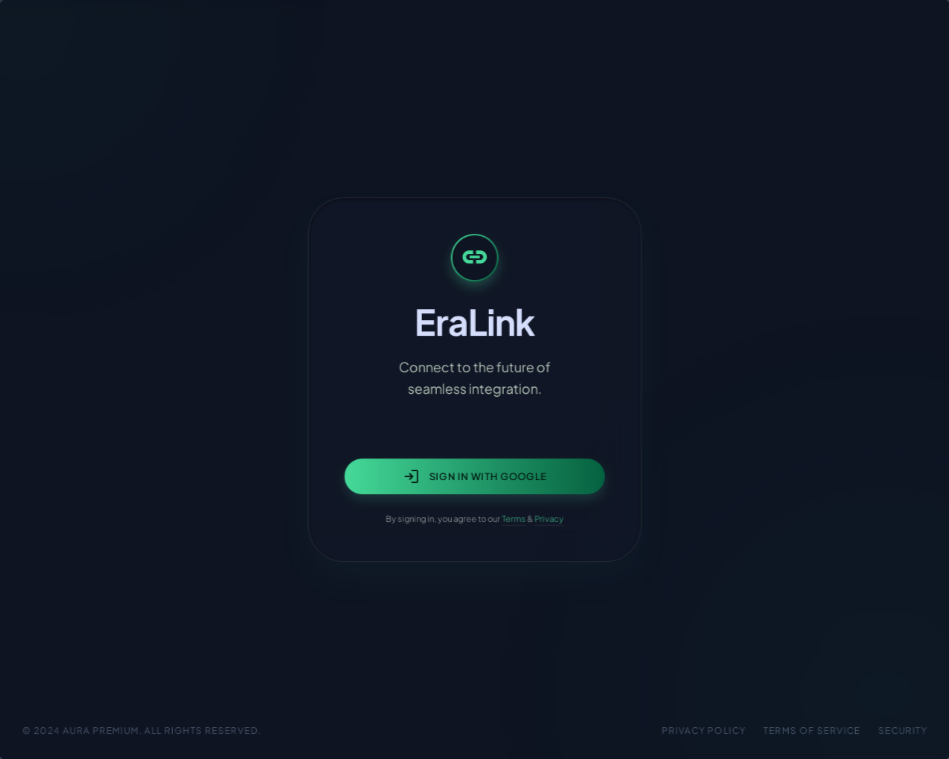
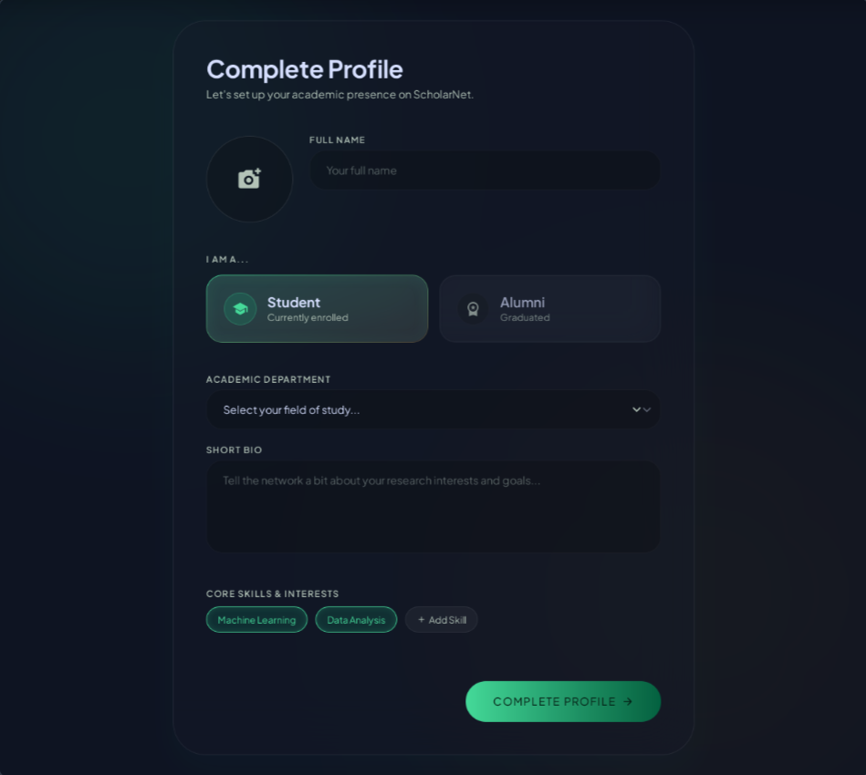
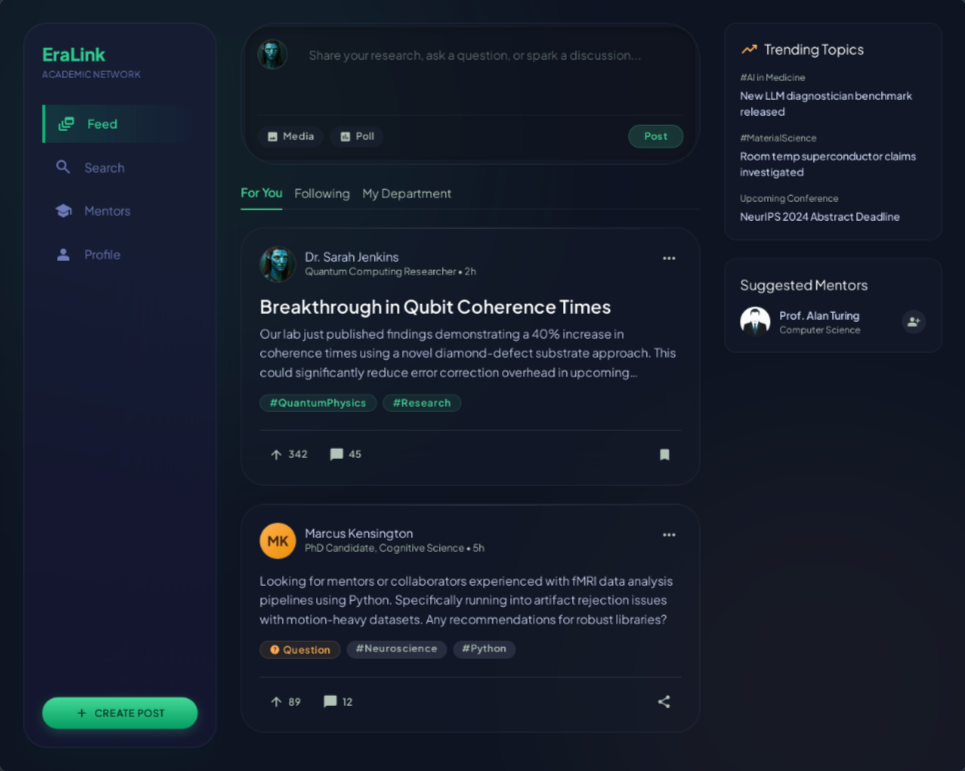
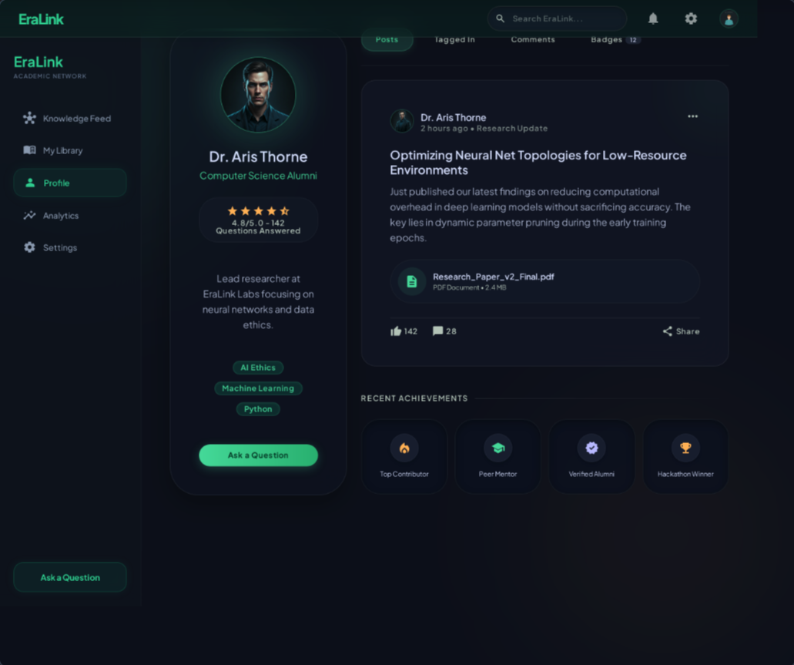

# EraLink: Sprint 1 MVP Wireframes

This document contains the annotated UI wireframes for the core Sprint 1 flows, implementing the Liquid Material (Emerald & Gold) design system.

## 1. OAuth Login Page

**Design Annotations:**
* **Strict OAuth Compliance:** Features only a "Sign in with Google" button. Password inputs have been completely removed to align with the professor's security mandate and prevent hacking vulnerabilities.
* **Liquid Material Aesthetics:** Utilizes deep background blurs and emerald glowing shadows to establish a premium, high-trust environment.

---

## 2. First-Time Setup (Onboarding)

**Design Annotations:**
* **Expertise Identification:** Forces users to define their role (Student vs. Alumni), department, and specific skill tags during onboarding. This directly builds the NEU expert repository.
* **Frictionless UI:** Uses large touch targets and recessed glass input fields for a highly accessible mobile-first experience.

---

## 3. Universal Feed Shell

**Design Annotations:**
* **Public Knowledge Hub (SECI - Socialization):** Replaces private messaging with a public feed where students and alumni interact openly. 
* **Tagging & Filtering:** Includes a right-side panel (desktop) or hamburger menu (mobile) for filtering by predefined fields and user-defined hashtags, making knowledge discoverable.

---

## 4. User Profile & Direct Q&A

**Design Annotations:**
* **Direct "Ask a Question" CTA:** Students can visit an alumni's profile and post a query directly to them, fulfilling the professor's direct-questioning requirement.
* **Helpfulness Star Rating:** Replaces the generic authority score. Displays a 5-star rating based strictly on whether the alumni actively answers the student queries directed at them.
* **Skill Showcase:** Prominently displays the alumni's predefined field and skill tags for easy discovery.